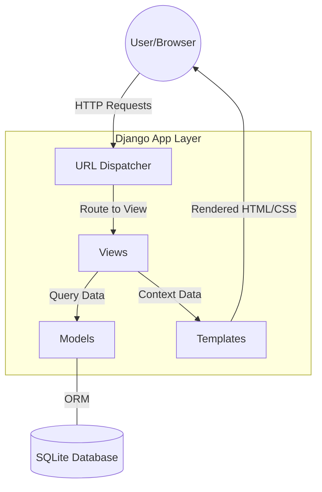
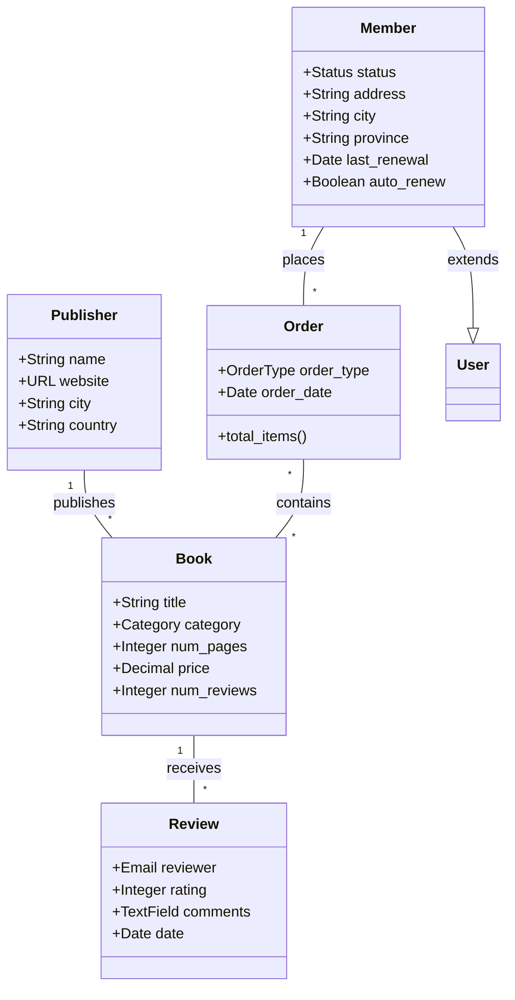

# DBOOK - Premium eBook Platform

DBOOK is a modern, premium Django-based eBook management platform featuring a high-end Glassmorphism design system, comprehensive review management, and advanced administrative tools.

## System Design

### High-Level Design (HLD)

The application follows the **Django MVT (Model-View-Template)** architecture, ensuring a clean separation of concerns between data, business logic, and presentation.



### Low-Level Design (LLD)

The data model is structured around five core entities, providing robust support for publishers, book catalogs, members, ordering, and community feedback.



## Features

- **Premium UI**: Modern Glassmorphism theme with blue-green gradients and smooth micro-animations.
- **Member Management**: Extended user profiles with borrowing history and session tracking.
- **Review System**: Integrated book reviews with average rating calculations and comment threads.
- **Advanced Admin**: Customized Django admin interface for rapid catalog management.
- **Search & Filter**: Keyword and category-based book discovery system.

## Getting Started

1. **Install Dependencies**:
   ```bash
   pip install django
   ```
2. **Setup Database**:
   ```bash
   python manage.py migrate
   ```
3. **Run Server**:
   ```bash
   python manage.py runserver
   ```
