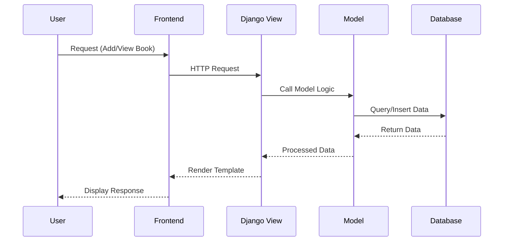
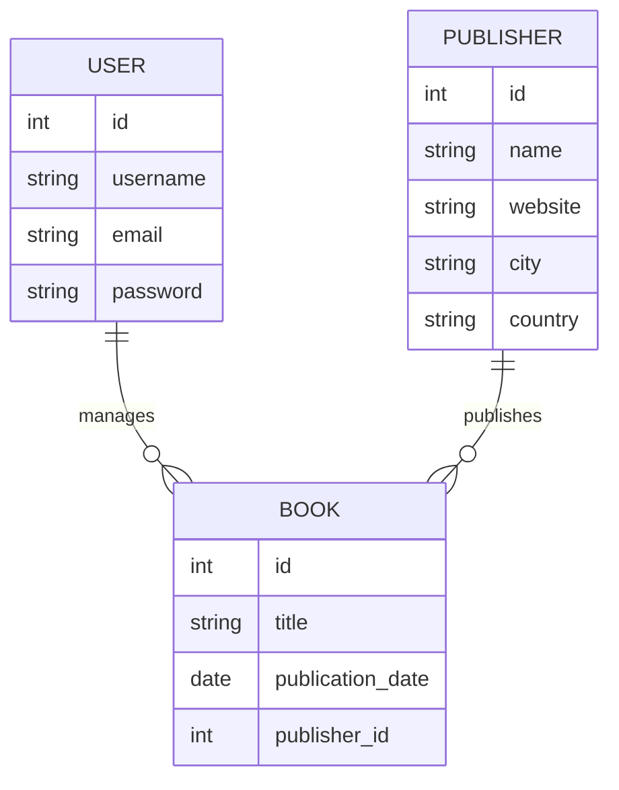
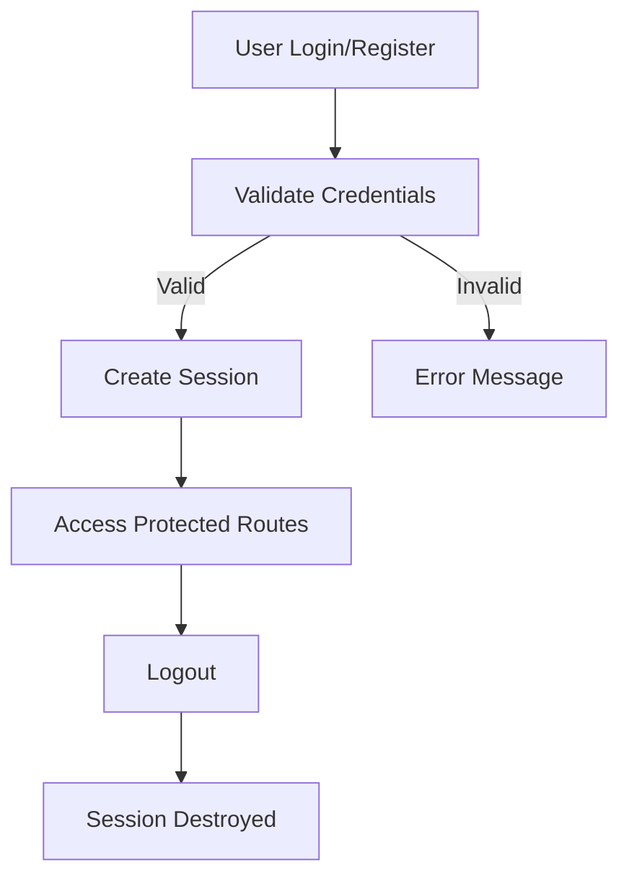

Here’s an upgraded **README.md** with a **complete system design diagram section** using **Markdown + Mermaid diagrams** (these render directly on GitHub and look very professional):

---

# DBOOK – Library Management System

DBOOK is a full-stack library management web application built using Django. It enables efficient management of books, publishers, and users through a structured and scalable system.

---

## Overview

This project demonstrates real-world full-stack development with a focus on backend architecture, database design, authentication, and CRUD operations.

---

## Features

* Book Management (Create, Read, Update, Delete)
* Publisher Management
* User Authentication (Login/Register/Logout)
* Search and Filtering
* Admin Dashboard (Django Admin)
* Secure Data Handling

---

## Tech Stack

* Backend: Django (Python)
* Frontend: HTML, CSS, JavaScript
* Database: SQLite / PostgreSQL
* Authentication: Django Built-in Auth

---

## System Design

### 1. High-Level Architecture

```mermaid
flowchart TD
    A[User Browser] --> B[Frontend Templates (HTML/CSS/JS)]
    B --> C[Django URL Dispatcher]
    C --> D[Django Views]
    D --> E[Django Models (ORM)]
    E --> F[(Database)]
    D --> B
```

---

### 2. Detailed Application Flow



---

### 3. Component Architecture

```mermaid
flowchart LR
    A[Client Layer] --> B[Application Layer]
    B --> C[Database Layer]

    subgraph Client Layer
        A1[Browser UI]
    end

    subgraph Application Layer (Django)
        B1[URLs]
        B2[Views]
        B3[Models]
        B4[Forms]
        B5[Authentication]
    end

    subgraph Database Layer
        C1[(SQLite/PostgreSQL)]
    end
```

---

### 4. Database Schema (ER Diagram)



---

### 5. Authentication Flow



---

### 6. Deployment Architecture (Future Scope)

```mermaid
flowchart TD
    A[User] --> B[Frontend (Browser)]
    B --> C[Web Server (Gunicorn)]
    C --> D[Django App]
    D --> E[(PostgreSQL DB)]
    D --> F[Cache (Redis)]
    C --> G[Nginx]
```

---

## Installation

```bash
git clone https://github.com/your-username/dbook.git
cd dbook
python -m venv venv
source venv/bin/activate  # Mac/Linux
venv\Scripts\activate     # Windows
pip install -r requirements.txt
python manage.py migrate
python manage.py runserver
```

---

## Usage

* App: [http://127.0.0.1:8000/](http://127.0.0.1:8000/)
* Admin Panel: [http://127.0.0.1:8000/admin/](http://127.0.0.1:8000/admin/)

---

## Future Improvements

* Book Borrow/Return System
* Role-Based Access Control
* REST API (Django REST Framework)
* React Frontend Integration
* Cloud Deployment (AWS/GCP)

---

## Contribution

Contributions are welcome. Fork the repository and submit a pull request.

---

