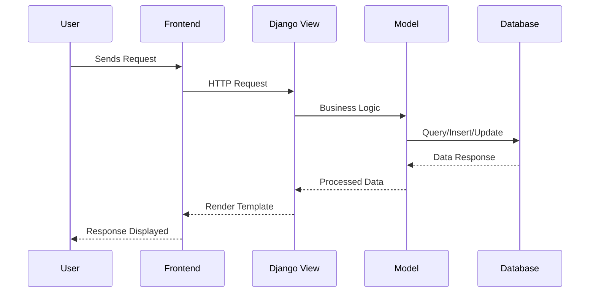
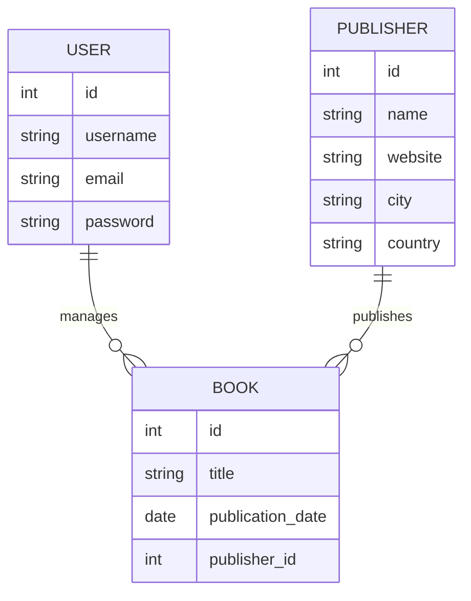
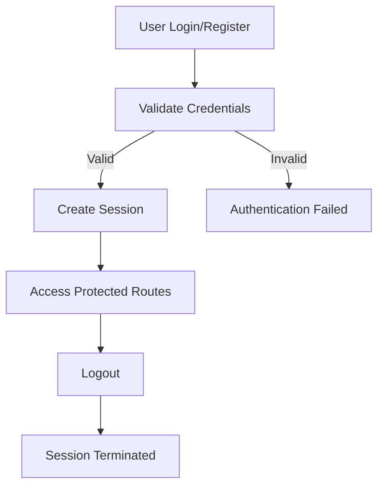
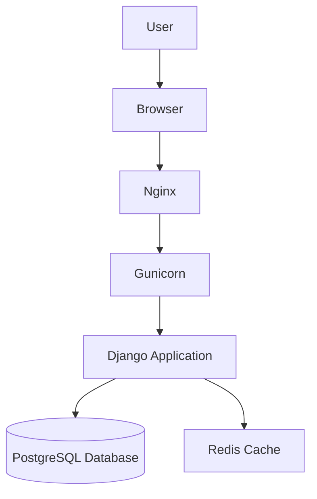

# DBOOK – Library Management System

A full-stack library management web application developed under **LSP Technologies Inc., Canada**.  
DBOOK provides a structured and scalable platform to manage books, publishers, and users efficiently.

Repository: https://github.com/Dipeshrajjoshi/DBOOK.git

---

## Overview

DBOOK is designed to demonstrate real-world full-stack development using Django, focusing on backend architecture, database design, authentication, and CRUD operations. The project reflects industry-level practices for building scalable and maintainable web applications.

---

## Features

- Book Management (Create, Read, Update, Delete)
- Publisher Management
- User Authentication (Login, Register, Logout)
- Search and Filtering Functionality
- Admin Dashboard using Django Admin
- Secure Data Handling with Django ORM

---

## Tech Stack

- Backend: Django (Python)
- Frontend: HTML, CSS, JavaScript
- Database: SQLite (development) / PostgreSQL (production-ready)
- Authentication: Django Built-in Authentication System

---

## System Design

### 1. High-Level Architecture

```mermaid
flowchart TD
    A[User Browser] --> B[Frontend Templates (HTML/CSS/JS)]
    B --> C[Django URL Dispatcher]
    C --> D[Django Views]
    D --> E[Django Models (ORM)]
    E --> F[(Database)]
    D --> B
```

---

### 2. Request-Response Flow



---

### 3. Component Architecture

```mermaid
flowchart LR
    A[Client Layer] --> B[Application Layer]
    B --> C[Database Layer]

    subgraph Client Layer
        A1[Browser UI]
    end

    subgraph Application Layer (Django)
        B1[URLs]
        B2[Views]
        B3[Models]
        B4[Forms]
        B5[Authentication]
    end

    subgraph Database Layer
        C1[(SQLite/PostgreSQL)]
    end
```

---

### 4. Database Schema (ER Diagram)



---

### 5. Authentication Flow



---

### 6. Deployment Architecture (Scalable Design)



---

## Installation

```bash
git clone https://github.com/Dipeshrajjoshi/DBOOK.git
cd DBOOK
python -m venv venv

# Activate virtual environment
source venv/bin/activate      # Mac/Linux
venv\Scripts\activate         # Windows

pip install -r requirements.txt
python manage.py migrate
python manage.py runserver
```

---

## Usage

- Application: http://127.0.0.1:8000/
- Admin Panel: http://127.0.0.1:8000/admin/

---

## Organization

Developed under **LSP Technologies Inc., Canada**, focusing on building scalable software solutions and modern web applications.

---

## Future Improvements

- Book Borrow and Return System
- Role-Based Access Control (Admin/User)
- REST API Integration (Django REST Framework)
- Frontend Upgrade using React
- Cloud Deployment with Docker and AWS

---

## Why This Project

This project highlights:

- Strong understanding of Django architecture
- Experience with relational database design
- Implementation of authentication and authorization
- Ability to design scalable backend systems

---

## Contribution

Contributions are welcome. Fork the repository and submit a pull request.

---

## License

This project is licensed under the MIT License.
